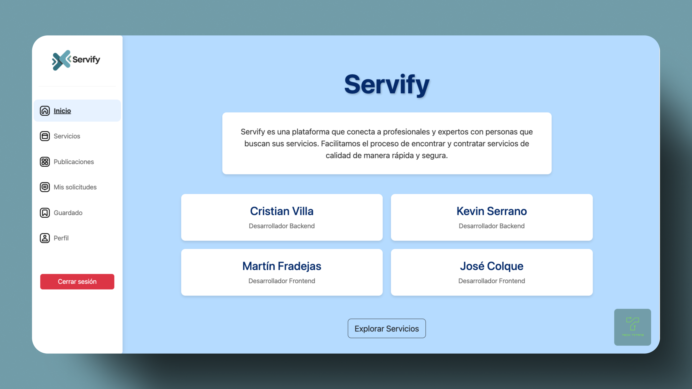
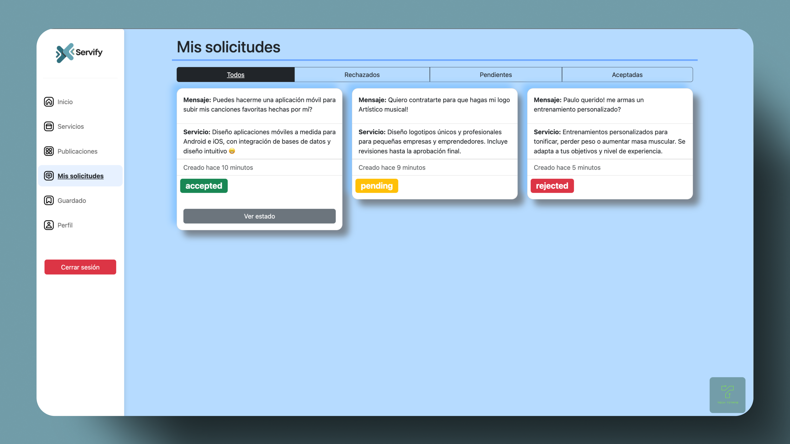

# "" SERVIFY ""

# Aplicacion de Servicio con React

## **Documentación Técnica**

### **Introducción del Proyecto**

- **Breve descripción de la aplicación:**
  Esta aplicación permite a los usuarios gestionar servicios de manera eficiente. La plataforma distingue dos tipos de usuarios:

  - BUSCADOR: Los usuarios pueden buscar servicios, contratarlos, revisar el estado de sus solicitudes, calificarlos y finalizar servicios en cualquier momento.
  - OFERENTE: Los usuarios pueden crear servicios, publicar ofertas, aceptar solicitudes, y actualizar el estado de los servicios ofrecidos.

- **Propósito y objetivos del proyecto:**
  El objetivo es proporcionar una plataforma intuitiva, responsiva y accesible para conectar oferentes con buscadores, facilitando la gestión de servicios desde cualquier dispositivo.

### **Guía de Instalación**

- **Requisitos previos**
  - Node.js (versión 14 o superior)
  - npm (versión 6 o superior)
  - React (versión 17 o superior)
  - Bootstrap (versión 5 o superior)

### **Instrucciones de instalación**

1. Clona el repositorio:
   ```bash
   git clone https://github.com/TinchoARS/FrontServices
   cd frontservices
   ```
2. Instala las dependencias:
   ```bash
   npm install
   ```
3. Inicia la aplicación:
   ```bash
   npm run dev
   ```

### **Configuración del entorno**

Variebale de entorno:
[`.env`](app/.env")

```env
VITE_BASE_URL = https://api-hn1b.onrender.com
```

### **Estructura de archivos y carpetas**

### **Descripción de los módulos**

- **components**: Contiene los componentes reutilizables de la aplicación.
- **contexts**: Contiene los contextos de React para la gestión del estado global.
- **hooks**: Contiene hooks personalizados utilizados en la aplicación.

### **Guía de Uso:**

- **Ejemplos de uso:**

OFERENTE:

    1. Inicia sesión como oferente.
    2. Ve a la sección "Servicios" y haz clic en "Agregar servicio".
    3. Accede a "Publicaciones" para crear una nueva oferta vinculada al servicio.

BUSCADOR:

    1. Inicia sesión como buscador.
    2. Ve a "Publicaciones" y contrata el servicio deseado.
    3. Accede a "Mis solicitudes" para revisar el estado de tus servicios contratados.

### **Capturas de pantalla**






### **Flujos de trabajo:**

    1. Explorar servicios: Los buscadores pueden navegar por las publicaciones activas.
    2. Contratar servicios: Los buscadores seleccionan y contratan servicios.
    3. Gestión de servicios: Los oferentes pueden administrar las solicitudes y cambiar el estado de sus servicios.

### **Mantenimiento y Actualización:**

#### Convenciones de código:

- Utiliza ESLint para mantener un estilo de código consistente.
- Sigue las convenciones de nomenclatura de React para componentes y archivos.

### **Documentación de Usuario Final**

#### Manual del Usuario:

    1. Abre la aplicación en tu navegador.
    2. Inicia sesión como oferente o buscador según tus necesidades.
    3. Gestiona servicios (crear o contratar) desde la interfaz intuitiva de la plataforma.

#### Descripción de funcionalidades:

    - Buscar servicios: Permite a los buscadores explorar las ofertas activas.

    - Crear servicios: Permite a los oferentes agregar nuevos servicios a la plataforma.

    - Publicar servicios: Permite a los oferentes crear publicaciones relacionadas con sus servicios.

    - Gestionar solicitudes: Los buscadores pueden revisar el estado de sus servicios contratados y calificarlos.

    - Actualizar estado: Los oferentes pueden cambiar el estado de un servicio según su progreso.

#### Preguntas Frecuentes (FAQs):

    - ¿Cómo contrato un servicio?: Ve a "Publicaciones", selecciona un servicio y haz clic en "Contratar".

    -¿Cómo califico un servicio?: Accede a "Mis solicitudes", selecciona el servicio finalizado y agrega tu calificación.

    -¿Puedo modificar una publicación creada?: Sí, ve a "Publicaciones", selecciona la publicación y edita los detalles.

# React + Vite

This template provides a minimal setup to get React working in Vite with HMR and some ESLint rules.

Currently, two official plugins are available:

- [@vitejs/plugin-react](https://github.com/vitejs/vite-plugin-react/blob/main/packages/plugin-react/README.md) uses [Babel](https://babeljs.io/) for Fast Refresh
- [@vitejs/plugin-react-swc](https://github.com/vitejs/vite-plugin-react-swc) uses [SWC](https://swc.rs/) for Fast Refresh
